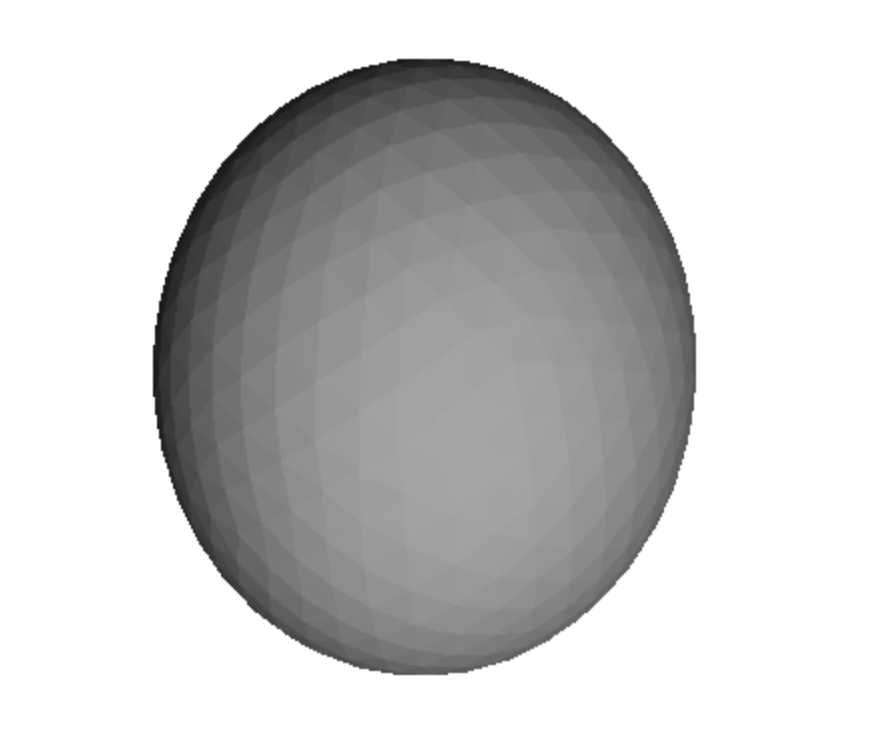
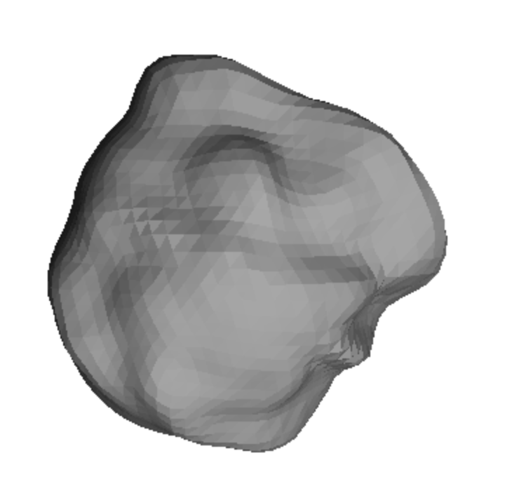

# 3D-реконструкция объекта из 2D УЗИ (HC18)

## Задача
Из 2D УЗИ-снимков головы плода построить **3D-модели в формате STL**.
Результат должен открываться в любом стандартном 3D-просмотрщике
(Windows 3D Viewer, Blender, MeshLab, viewstl.com).

## Датасет
- **HC18** (Grand Challenge): 999 обучающих 2D УЗИ-снимков головы плода.
- Источник: https://hc18.grand-challenge.org/
- DOI: 10.5281/zenodo.1322001
- Размер изображений: 800×540 px, pixel_size: 0.052–0.326 мм.
- Разметка: эллипс вокруг головы (`*_Annotation.png`) + CSV с pixel_size
  и окружностью головы (HC).

## Ограничения метода
Датасет содержит **только 2D-снимки** (по одному срезу на пациента),
поэтому полная анатомическая 3D-реконструкция невозможна — информации
недостаточно. Мы строим **3D-модель-аппроксимацию** (эллипсоид) и
**модель с рельефом** (на основе яркости УЗИ).

## Пайплайн

### 1. Разделение файлов
- `*_HC.png` → `data/images/`
- `*_Annotation.png` → `data/annotations/`

### 2. Сегментация (аннотация → бинарная маска)
- Порог 127 (эллипс белый на чёрном фоне).
- Морфологическое закрытие (ядро 5×5, 2 итерации) — чтобы закрыть разрывы.
- Поиск внешних контуров, берём самый большой.
- Заливка контура → бинарная маска.
- Сохранение в `data/masks/` как `*_mask.png` (999 файлов).

### 3. Валидация масок
Сравнение окружности головы (HC), посчитанной из маски, с HC из CSV:
- Средняя разница: **0.75 мм**
- Медиана: **0.69 мм**
- Максимум: **2.15 мм**
- 99.9% файлов с diff < 2 мм
- 0 файлов с diff > 5 мм
- Полный отчёт: `output/mask_validation.csv`

### 4. Построение 3D-меша (гладкий эллипсоид)
- Подгонка эллипса к маске через `cv2.fitEllipse` → полуоси (a, b) в мм.
- Третья ось: c = (a + b) / 2 (предположение осевой симметрии).
- Построение эллипсоида через `trimesh.creation.icosphere(subdivisions=3)`.
- Масштабирование по осям (a, b, c) в мм.
- Экспорт в `output/stl/*_3d.stl` (999 файлов).

### 5. Карта высот из яркости (heightmap)
Дополнительный эксперимент: **использование яркости УЗИ как рельефа**.
- Внутри маски берётся яркость пикселей.
- Сглаживание (`gaussian_filter`) — убирает шум УЗИ.
- Нормализация яркости в высоту [0, `HEIGHT_MAX_MM`].
- Построение 3D-поверхности через `trimesh` + `scipy.spatial.Delaunay`.
- Закрытие меша (плоское дно + боковые стенки) для водонепроницаемости.

**Примечание:** это **визуализация**, а не анатомическая реконструкция —
яркость УЗИ отражает эхогенность (плотность ткани), а не физическую высоту.

### 6. Анатомический эллипсоид с рельефом (объединение подходов)
Комбинация эллипсоида и карты высот:
- **Базовая форма** — эллипсоид из маски (размеры головы).
- **Рельеф** — яркость УЗИ проецируется на поверхность эллипсоида
  как смещение по нормали (яркое → выпуклость, тёмное → впадина).
- Экспорт в `output/anatomical_*_HC.stl`.

Это даёт **объёмную голову с рельефом**, ближе к анатомии, чем плоский
heightmap.

**Параметры:**
- `HEIGHT_MAX_MM = 3.0` — максимальное смещение бугров.
- `SMOOTH_SIGMA = 8.0` — сглаживание.
- `SUBDIVISIONS = 4` — детальность (≈5000 вершин).

---

## Результаты

### Созданные файлы
- **999 STL-моделей** (гладкие эллипсоиды) в `output/stl/`
- **Примеры анатомических моделей** в `output/anatomical_*.stl`
- **Визуальное сравнение** `output/comparison.png` (УЗИ | Маска | 3D)
- **Статистика моделей** `output/model_stats.csv`
- **Валидация масок** `output/mask_validation.csv`
- **Все 999 масок** в `data/masks/`

### Статистика моделей (эллипсоиды, 999 моделей, 0 ошибок)
| Метрика | Мин | Среднее | Макс |
|---|---|---|---|
| Объём (куб. мм) | 1472.6 | 124666.2 | 692519.6 |
| Габарит X (мм) | 12.94 | 48.92 | 99.46 |
| Габарит Y (мм) | 15.44 | 61.91 | 122.60 |
| Габарит Z (мм) | 14.19 | 55.41 | 110.46 |

- Всего моделей: **999**
- Ошибок: **0**
- Все модели водонепроницаемы (`mesh.is_watertight == True`).

### Замечание о выбросах
Диапазон объёма: 1472–692519 куб. мм. Максимальное значение (~692 мл)
превышает типичный объём головы плода на поздних сроках (300–500 мл).
Это, вероятно, связано с выбросами в разметке исходного датасета.
Медианный объём (~110000 куб. мм) находится в нормальном диапазоне.

---

## Инструменты
- Python 3.11
- OpenCV (`cv2`) — обработка изображений, сегментация, подгонка эллипса
- NumPy — численные операции
- Pandas — обработка CSV
- SciPy (`gaussian_filter`, `Delaunay`) — сглаживание и триангуляция
- trimesh — построение 3D-меша и экспорт в STL
- matplotlib — визуализация
- tqdm — прогресс-бары

---

## Структура проекта

project/
├── README.md 
├── requirements.txt # зависимости
├── make_masks.py # аннотация → маска
├── make_all_stl.py # маска → STL
├── heightmap_to_stl.py # маска + яркость → heightmap STL
├── visualize_results.py # comparison.png
├── model_stats.py # model_stats.csv
├── data/
│ ├── images/ # исходные УЗИ
│ ├── annotations/ # УЗИ с эллипсами
│ ├── masks/ (999) # бинарные маски
│ └── training_set_pixel_size_and_HC.csv
└── output/
├── stl/ (999) # гладкие эллипсоиды
├── anatomical_.stl # анатомические модели (примеры)
├── comparison.png # УЗИ | Маска | 3D
├── model_stats.csv # статистика по моделям
└── mask_validation.csv # качество масок vs CSV
└── example/




---

## Как воспроизвести
```bash
# 1. Установить зависимости
pip install -r requirements.txt

# 2. Сгенерировать маски из аннотаций
python make_masks.py

# 3. Построить гладкие эллипсоиды для всех масок
python make_all_stl.py

# 4. Построить анатомический эллипсоид с рельефом
python heightmap_to_stl.py

# 5. Визуализировать результаты
python visualize_results.py

# 6. Посчитать статистику
python model_stats.py